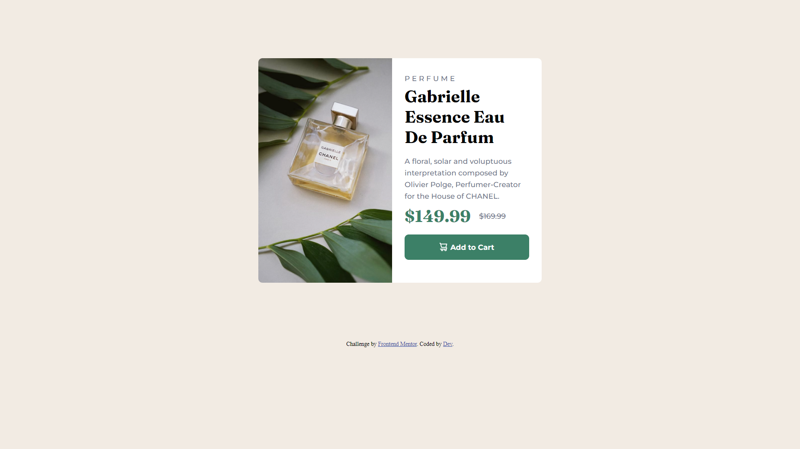
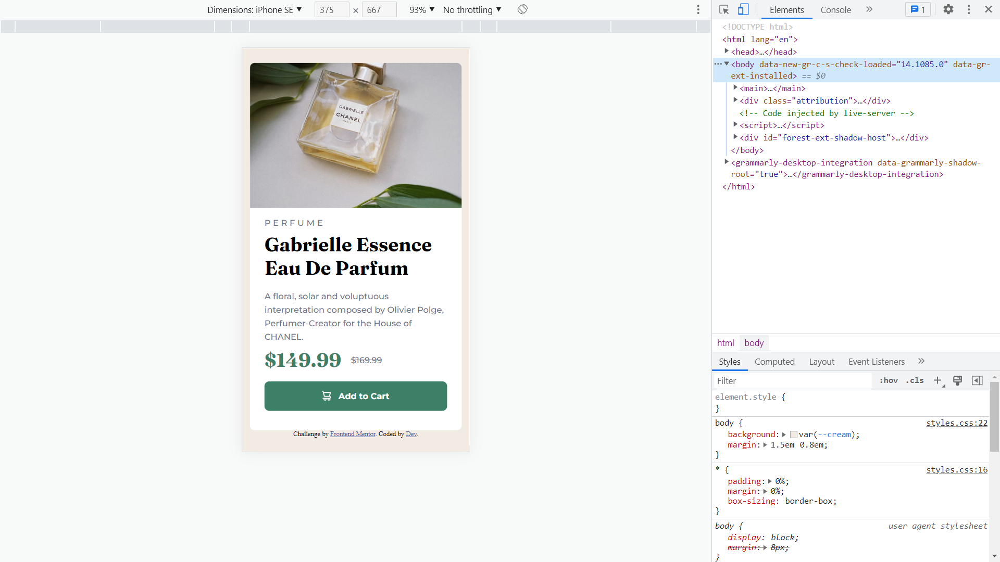

# Frontend Mentor - Product preview card component solution

This is a solution to the [Product preview card component challenge on Frontend Mentor](https://www.frontendmentor.io/challenges/product-preview-card-component-GO7UmttRfa). Frontend Mentor challenges help you improve your coding skills by building realistic projects. 

## Table of contents

- [Overview](#overview)
  - [The challenge] Product preview card component
  - [Screenshot](#screenshot)
  - [Links](#links)
- [My process] Mobile-First -> Desktop. 
  - [Built with] - HTML, CSS
  - [What I learned] - I learned how to control images using background-image. Refreshed my knowledge regarding @media for responsive design

## Overview

### The challenge

Users should be able to:

- View the optimal layout depending on their device's screen size
- See hover and focus states for interactive elements

### Screenshot

### Links

- Live Site URL: [Add live site URL here](https://your-live-site-url.com)

## My process

### Built with

- Semantic HTML5 markup
- CSS custom properties
- Flexbox
- CSS Grid
- Mobile-first workflow

### What I learned

I learned how to control images using background-image. Refreshed my knowledge regarding @media for responsive design. Still there are points where I was stuck to create the layout. So, I will keep upskill and try to optimize a bit more in the future.

## Author

- Frontend Mentor - [@Dev](https://www.frontendmentor.io/profile/devgobind)
- Twitter - [@Dev](https://twitter.com/gobind_dev)
